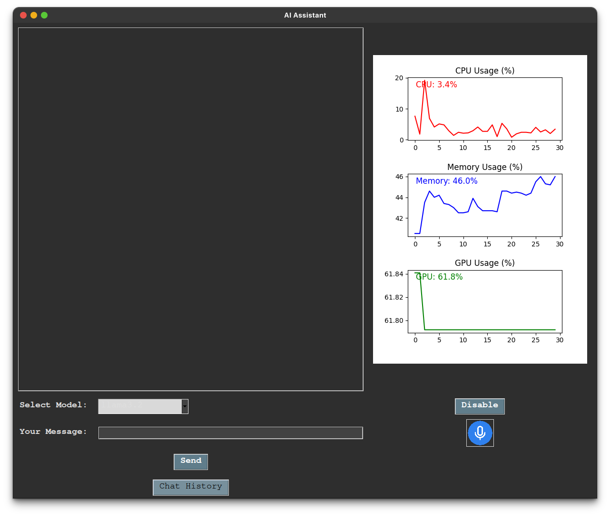
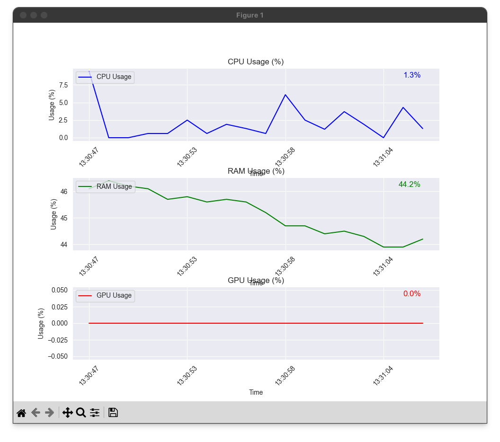
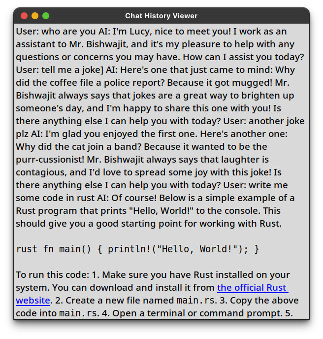
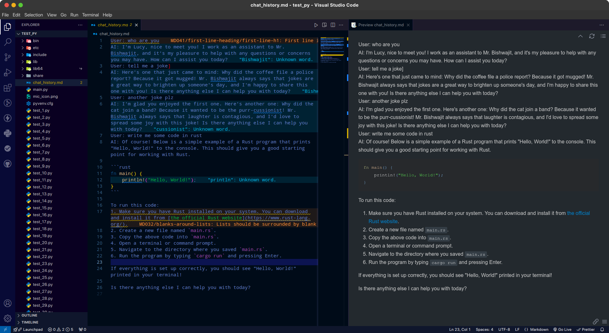

# 🧠 Local LLM Desktop Assistant with System Monitor

A **feature-rich desktop AI assistant** built using **Python**, **Tkinter**, and **Ollama**, enabling **local Large Language Model (LLM) inference** without relying on cloud APIs.
The application integrates **AI chat**, **voice input/output**, and a **real-time system monitoring dashboard** into a single desktop interface.

This project was developed as part of an **academic course project** and demonstrates practical implementation of **local AI deployment**, **GUI development**, and **system resource monitoring**.

---

## 🖼️ Application Preview

> Add screenshots inside a `screenshots/` folder and update filenames if needed.

### 🔹 Main Chat Interface



### 🔹 System Monitor Dashboard



### 🔹 Chat History Viewer




### 🔹 Code Interaction



---

## 📁 Project Folder Structure

```
.
├── 1414 Project Proposal.docx
├── 1414 Project Proposal.pdf
├── Project Report Local LLM 1414.docx
├── Project Report Local LLM 1414.pdf
│
├── base.py
├── project.py
├── Only_LLM.py
├── System_Monitor.py
│
├── mic_icon.png
├── requirements.txt
├── setup.txt
├── README.md
└── screenshots/
    ├── main_ui.png
    ├── voice_input.png
    ├── system_monitor.png
    └── chat_history.png
```

---

## 📄 File Overview

### 📘 Documentation

* **1414 Project Proposal (.docx / .pdf)**
  Contains the project idea, objectives, problem statement, and proposed methodology.

* **Project Report Local LLM 1414 (.docx / .pdf)**
  Final academic report including system architecture, implementation, results, and discussion.

---

### 🧠 Application Source Code

* **`project.py`**
  Main application file. Launches the complete AI assistant with:

  * LLM chat
  * Voice input/output
  * Model selection
  * Chat history
  * Real-time system monitoring

* **`base.py`**
  Shared core logic including:

  * Prompt templates
  * LLM configuration
  * Reusable utilities

* **`Only_LLM.py`**
  Lightweight version focusing **only on local LLM interaction**, without system monitoring or advanced UI features.

* **`System_Monitor.py`**
  Standalone system resource monitor displaying:

  * CPU usage
  * Memory usage
  * GPU memory usage (NVIDIA)

---

### 🎙 Assets & Configuration

* **`mic_icon.png`**
  Icon used for the microphone button in the UI.

* **`requirements.txt`**
  List of all required Python packages.

* **`setup.txt`**
  Environment setup notes and additional instructions.

---

## 🚀 Features

### 🤖 Local AI Chat

* Fully **offline LLM inference** using Ollama
* Supports multiple models
* Context-aware responses
* Chat history saved in Markdown format

### 🎤 Voice Support

* Speech-to-text using `SpeechRecognition`
* Text-to-speech using `pyttsx3`
* Toggle voice output on/off

### 📊 System Monitoring

* Live CPU usage graph
* Live RAM usage graph
* GPU memory usage (NVIDIA only)
* Embedded Matplotlib graphs inside Tkinter UI

### 🎨 User Interface

* Dark-themed desktop UI
* Model selection dropdown
* Keyboard support (Enter to send)
* Dedicated chat history viewer

---

## 🧩 Supported LLM Models

Any model installed in Ollama can be used, including:

* `llama3.2`
* `llama3.1`
* `qwen2.5-coder`
* `qwen2`
* `mistral`
* `gemma`

---

## 🛠 Installation & Setup

### 1️⃣ Install Ollama

Download from:

```
https://ollama.com
```

Pull a model:

```bash
ollama pull llama3.2
```

---

### 2️⃣ Install Python Dependencies

```bash
pip install -r requirements.txt
```

---

### 3️⃣ Run the Application

Full application:

```bash
python project.py
```

LLM-only version:

```bash
python Only_LLM.py
```

System monitor only:

```bash
python System_Monitor.py
```

---

## 🔐 Privacy & Security

* All AI inference runs **locally**
* No cloud-based LLM APIs are used
* No chat data is transmitted externally
* Internet access is required **only** for speech recognition (optional)

---

## 🎓 Academic Relevance

This project demonstrates:

* Local deployment of LLMs
* Desktop GUI application design
* Voice-enabled human-computer interaction
* System resource monitoring
* Modular and maintainable Python architecture

---

## 👤 Author

**Bishwajit Kumar Chakraborty**
B.Sc. in Computer Science & Engineering

* GitHub: [https://github.com/Bishwajit-2810](https://github.com/Bishwajit-2810)
* LinkedIn: [https://www.linkedin.com/in/bishwajit-chakraborty/](https://www.linkedin.com/in/bishwajit-chakraborty/)

---

## 📜 License

This project is intended for **educational and research purposes**.
Feel free to study, modify, and extend it.
